# Currently working on: 
Snapping zoom and coordinates from one map to the other
Keep working on Documentation - Styling Guide for map layers and Troubleshooting section

### Tips:
<!-- mapbox.getZoom(); mapbox.getCenter(); FUNCTION TO GET THE ZOOM LEVEL AND CENTRAL COORDINATES VALUES -->

# Documentation:

<!-- TABLE OF CONTENTS (WIP) -->

  
Table of Contents

  <ol>
    <li>
      <a href="#about-the-project">About</a>
      <ul>
        <li><a href="#ideas-be">IDEAS-BE</a></li>
        <li><a href="#cammm-project-web-atlas">CAMMM Project & Web Atlas</a></li>
        <li><a href="#contributors">Contributors</a></li>
        <li><a href="#license-funding">License & Funding</a></li>
        <li><a href="https://www.gnu.org/licenses/gpl-3.0.en.html">GNU General Public License v3.0</a></li>
      </ul>
    </li>
    <li>
      <a href="#getting-started">Section 1 - Getting Started</a>
      <ul>
        <li><a href="#software-requirements">Software Requirements</a></li>
        <li><a href="#how-to-write-docs">How to write the documentation</a></li>
        <li><a href="#useful-links">Useful Links</a></li>
      </ul>
    </li>
    <li>
      <a href="#processing-tool">Section 2 - Processing Tool</a>
      <ul>
        <li><a href="#use-proc-tool">Use of the Processing Tool</a></li>
        <li><a href="#data-collection">Data Collection</a></li>
        <li><a href="#op-functions">Operational Functions</a></li>
        <li><a href="#key-functions">Analysis Functions</a></li>
        <li><a href="#processed-data-mapbox">Processed Data for Mapbox & City Metrics</a></li>
      </ul>
    </li>
    <li>
      <a href="#using-mapbox">Section 3 - Using Mapbox</a>
      <ul>
        <li><a href="#create-city-map">Creating a City Map</a></li>
        <li><a href="#styling-map-layers">Styling Map Layers</a></li>
        <li><a href="#integrate-web-atlas">Integrating to Web Atlas</a></li>
      </ul>
    </li>
    <li>
      <a href="#model-city-object">Section 4 - Modelling City Object(JS)</a>
      <ul>
        <li><a href="#city-metrics-data">City Metrics Data</a></li>
        <li><a href="#city-object-parameters">Parameters</a></li>
        <li><a href="#city-object-functions">Functions</a></li>
      </ul>
    </li>
    <li>
      <a href="#develop-atlas-ui">Section 5 - Developing the Web Atlas UI</a>
      <ul>
        <li><a href="#ui-layout-html">UI Layout in HTML</a></li>
        <li><a href="#script-web-atlas">Scripting the Web Atlas</a></li>
        <li><a href="#styling-manual">Styling Manual</a></li>
      </ul>
    </li>
    <li>
      <a href="#appendix">Appendix</a>
      <ul>
        <li><a href="#appendix-a">Appendix A - Maintaining GitHub Repo & Page</a></li>
        <li><a href="#appendix-b">Appendix B - Managing Development Workflow</a></li>
        <li><a href="#appendix-b">Appendix C - Troubleshooting</a></li>
      </ul>
    </li>
  </ol>

----------------------------------------------------------------------

<!-- ACTUAL DOCUMENTATION -->
----------------------------------------------------------------------

## About

  #### CAMMM Web Atlas Tool
  https://github.com/ideas-be/CAMMM-Web-Tool/tree/cumulative-testing
  **Here is the link to see the website proper:**
  https://ideas-be.github.io/CAMMM-Web-Tool/
  **Here is the link to the Miro board:**
  https://miro.com/app/board/o9J_kgmIpbw=/
  #### Preview:
  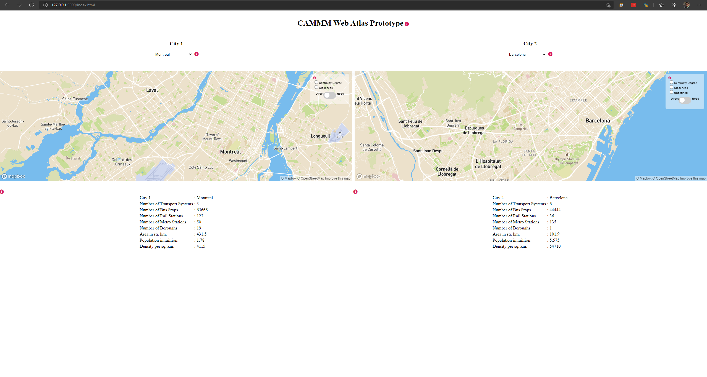

  

  
  ### IDEAS-BE
  
  

  

  
  ### CAMMM Project & Web Atlas
  
  

  

  
  ### Contributors
  
  

  

  ### License & Funding

  <a href="https://www.gnu.org/licenses/gpl-3.0.en.html">GNU General Public License v3.0</a>

  

----------------------------------------------------------------------

## Section 1 - Getting Started

  

  ### Software Requirements

  

  
  

  ### How to write the documentation

  

  
  

  
  ### Useful Links

  #### Mapbox
  **Style URL example**
  mapbox://styles/carmela-cucuzzella/ckguxoar50i7w19qyf3c6qsdg
  
  

        

----------------------------------------------------------------------

## Section 2 - Processing Tool

  

  
  ### Use of the Processing Tool
  

  
  

  
  ### Data Collection
  

  
  

  
  ### Operational Functions
  

  
  

  
  ### Analysis Functions
  

  
  

  
  ### Processed Data for Mapbox & City Metrics
  

----------------------------------------------------------------------

## Section 3 - Using Mapbox

  
<a href ="https://en.wikipedia.org/wiki/Mapbox">Mapbox</a> is a provider of custom online maps for websites and applications. Inside of Mapbox, it is possible to manage geospatial data and design custom map styles.

   Mapbox is the creator of, or a significant contributor to, some open source mapping libraries and applications. Mapbox uses anonymised data from geolocation services such as OpenStreetMap, Strava, RunKeeper, etc.
   
   We use Mapbox to host the processed data from the selected cities. This is done using the Mapbox <a href="https://studio.mapbox.com/">Studio</a> using the IDEAS-BE credentials. Each city map is called a <em>Style</em> inside of Mapbox and all the data is stored in form of <em>Tilesets</em>. The upload format is a custom version of Geo-JSON. (Check <a href="#appendix-b">Appendix B</a> for example.) The processing software delivers in ready to be uplodaded files.
  
  

  ### Creating a City Map
  The mpas that contatin all the processed data for each city are created following these 2 main steps:

    TL//DR
    - Upload the necessary .geojson files as _Tilesets_ in Mapbox

    - Create a new style 
    
  -------------------------------------------------------------
  
  The city maps in MapBox are made by creating a Style and then uploading the corresponding Tileset for the map using drag and drop. To make the Tileset, the <a href="#processing-tool">Processing Tool</a> needs to be used.
   
  
  **Steps to upload the map:**

    - In the MapBox Studio, go to the Tileset section and select New Tileset.
  
  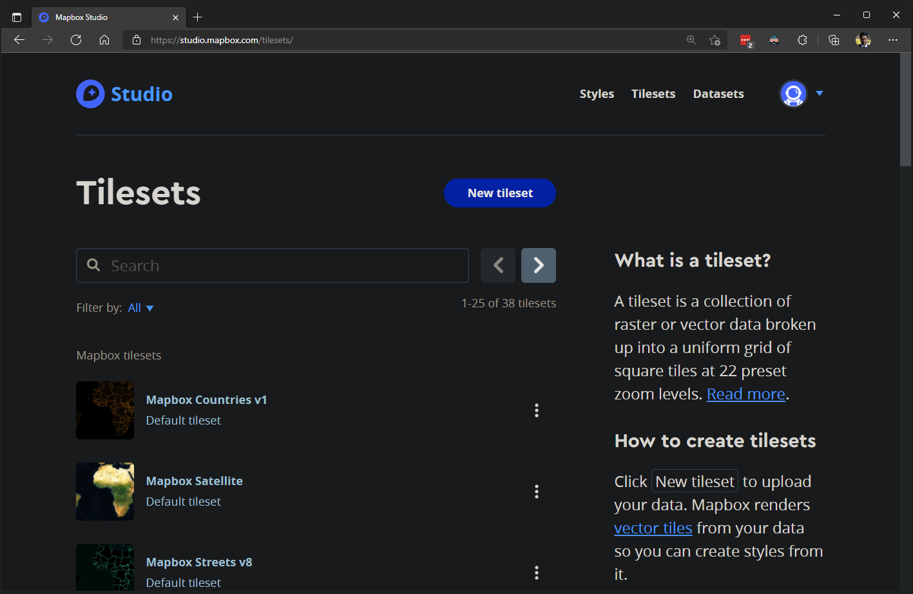

    - Upload the file containing the data you wish to display on the map.
  
  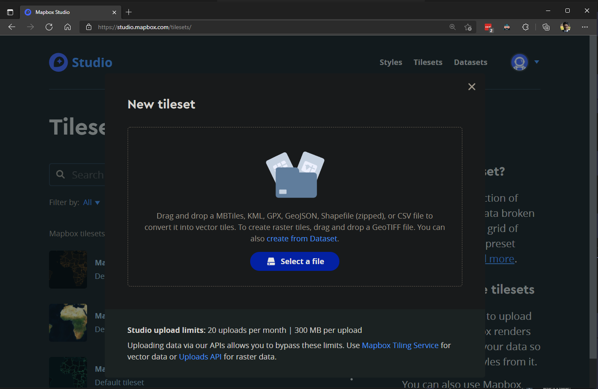

  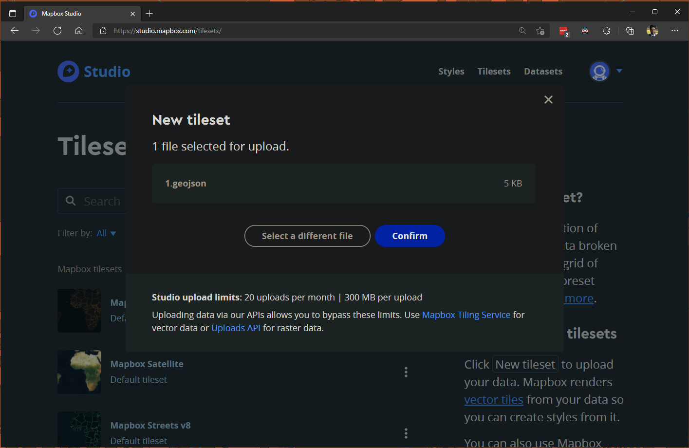

    - The upload will report success on the bottom right corner of the website. (see Troubleshoot section if the upload fails)

  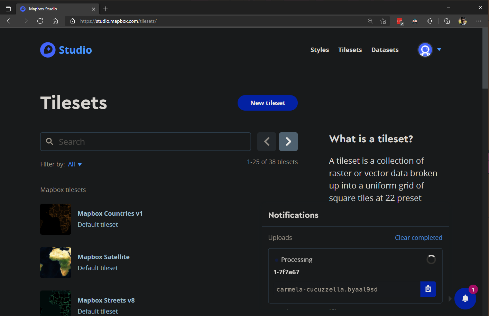

    - Once all the data is in Tileset a new map can be created. Inside of Mapbox, the Styles are the 'maps'.
    - Click the New Stule button.

  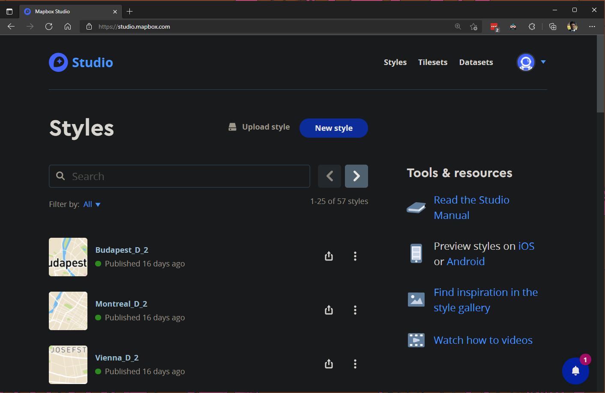

    - Select the appropriate temple, for this project we have used the 'Basic' as is.

  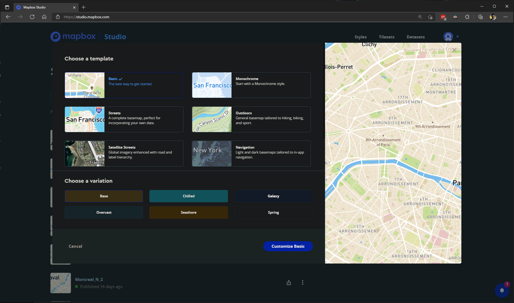

    - Once you landed on the map, you have to go to the plus icon on the top left side. There you will add the Tileset with the processed data.

  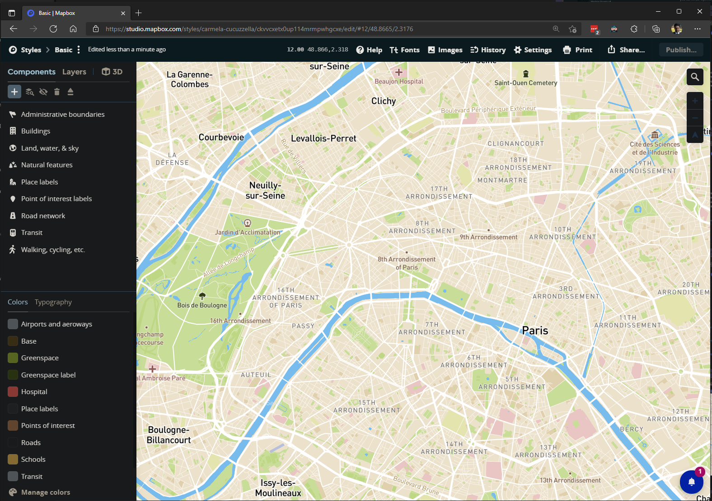

    - An alternative list of the tileset already loaded can be seen by changin from Components to Layers in the top left side.

  
  
    - After pressing the plus button (top-left), in the Source section you click on the 'None Selected'.

  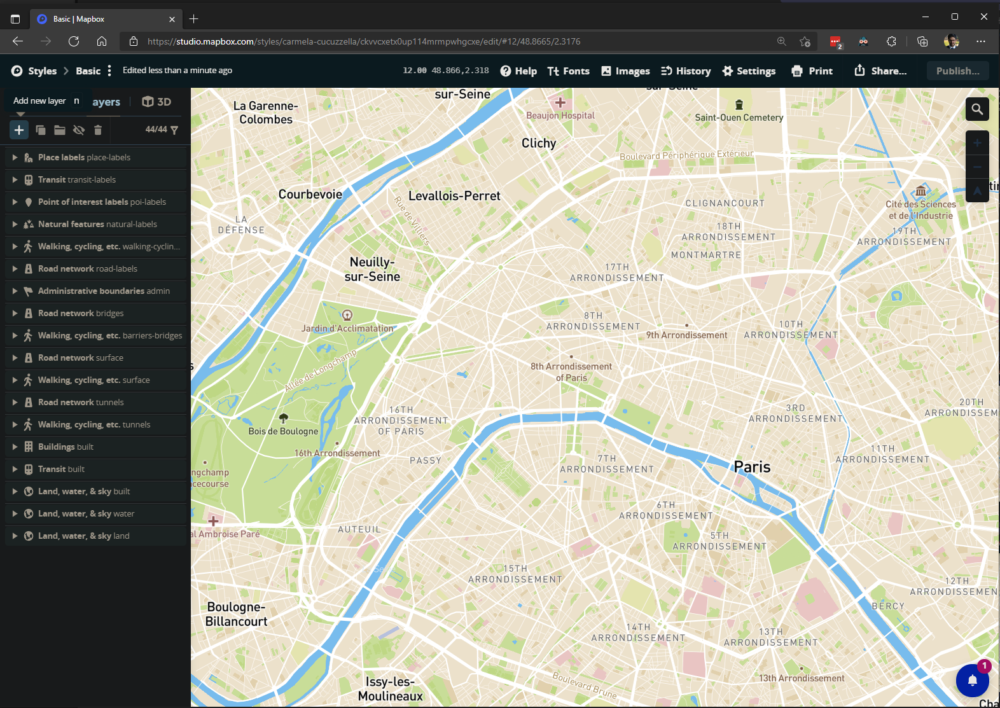

    - Navigate to the desired Tileset, you may also use the search bar with the name of the Tileset.

  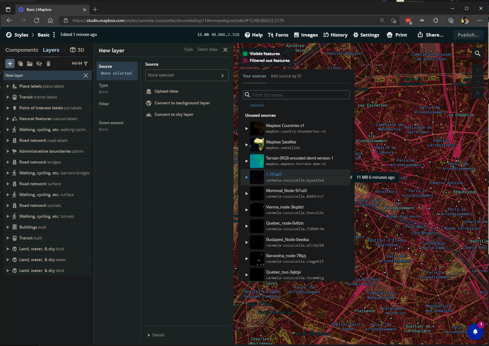

    - Change the Type as needed. View style guidelines for layer maps. 

  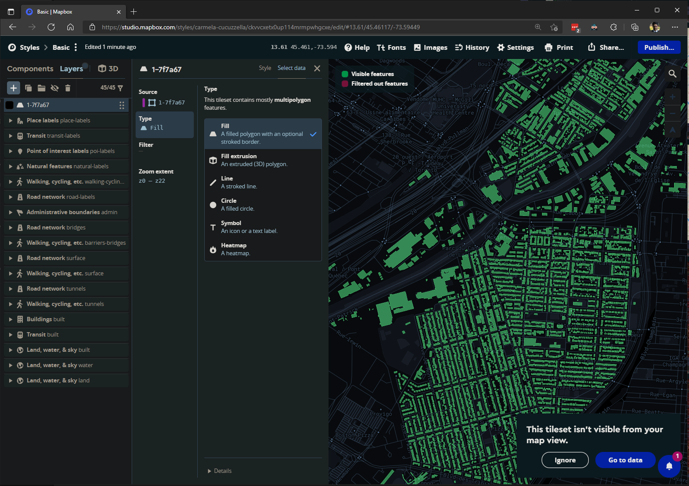

  
  

  

  
  

  
  ### Integrating to Web Atlas
 
 The MapBox is integrated into the UI of the CAMMM Atlas Web Application as follows:
 -Ensure that the map created in MapBox Studio has been _published_
 -Go to the Embed menu and copy the **Style URL** associated with the map
  Here is a sample syntax of the URL: _mapbox://styles/**user-name**/**style-url**_

  

  

----------------------------------------------------------------------

## Section 4 - Modelling City Object(JS)

  

  ### City Metrics Data

  

  

  ### Parameters

  

  

  ### Functions

  #### ORDER of functions inside City object

  0. (98)constructor - Called when -the city object is created- where -inside the city object-
  1. (111)readCityJson
  2. (124)loadMap
  3. (143)injectDirectNodeToggleHTML
  4. (156)getDirectNodeToggle
  5. (180)injectRadioButtons
  6. (194)getRadioStatus
  7. (208)injectCatCumulToggleHTML
  8. (224)getCatCumulToggle
  9. (245)injectCumulSlider
  10. (269)injectCatSlider
  11. ()turnOffAllLayers
  12. ()loadCumulativeLayers
  13. ()loadCategoryLayer
  14. ()displayCityMetrics

  #### Flow of functions inside **City.JS**

  1. **readCityJson**
      1. Stores the values for the coordinates and the zoom in the city object from the JSON file

  2. **loadMap**
      1. create themapbox container
      2. initializes new map with the city ural, coordinates, and zoom
      3. injects the mapsbox to display city map

  3. **injectDirectNodeToggleHTML**
      1. inserts a unique Direct/Node HTML Toogle to each city
      2. on change it calls the function getDirectNodeToggle and passes the status of the toogle

  4. **getDirectNodeToggle**
      1. The variable selAnalysis,
      2. Reads the values for the URL and list of layers, dependeing on the Value of selAnalysis (status of Toggle)
      3. if selAnalysis is True, then the cityURL and ListofLayers are read from **node** values inside Json object
      4. else, cityURL and ListofLayers are read from **direct** values inside Json object
      5. the functions loadMap and injectRadioButtons

  5. **Inject Radio buttons**
      1. the function takes city num and list of layers 
      2. initialize an hmtl variable that contations the injected radio buttons
      3. NameOfQueries is list of queries applied to the cities, it contains the names (of queries)
      4. a loop then goes thorugh the list of layers and display them as radio buttons
      5. inside the loop the radio buttons are injected, when clicked they call two functions: getRadioStatus and injectCatCumulToggleHTML

  6. **getRadioStatus**
      1. a new arry is created, called radioList, it takes the status value of the selected radio button 
      2. using a loop, radioList stores true or false values based on the selected radio buttons

  7. **injectCatCumulToggleHTML**
      1. inserts a unique Category/Cumulative HTML Toogle to each city
      2. on change it calls the function getCatCumulToggle and passes the status of the toggle

  8. **getCatCumulToggle**
      1. Read the toogle value and if True, inject Category Slider and load layers accordingly 
      2. else, the cumulative slider is injected and layers are loaded accordingly 

  9. **injectCumulSlider**
      0. Default position: For Cumul Slider, the head of the slider will be at the extreme right (highest value) to display all layers on map
      1. Based on the selected Query (Centrality or Closeness) the cumulative slider html is injected
      2. this slider contains values ranging from 1 to 5 with a step of one
      3. On change, the valirable: sliderValue from the city object gets the current slider value 
      4. The funcitons called are turn off all layerse and loadCumulativeLayers 

  10. **injectCatSlider** NO WRITTEN AT THE MOMENT OF DOCUMENTATION 

  11. **turnOffAllLayers**
      1. loops throught all layers and turns them off

  12. **loadCumulativeLayers**
      1.  loops the radio list with the status of the radio buttons, 
      2.  if radio button is true, it loops through the list of corresponding layers and truns them on **until the current slider value** (using the variable sliderValue of city object)

  13. **loadCategoryLayer**
      1. loops through all layers to find and turn on corresponding layer to current slider value 
      
  14. **displayCityMetrics**
      1. contains list of icons and stop types for  each transist systems
      2. inject html for citymetricTable, it contains the number of stops, the number of lines, and the average distance between stops

  

----------------------------------------------------------------------

## Section 5 - Developing the Web Atlas UI

  

  ### UI Layout in HTML

  

  

  ### Scripting the Web Atlas

  

  

  ### Styling Manual

  

----------------------------------------------------------------------

## Appendix

  

  ### Appendix A - Maintaining GitHub Repo & Page

  

  

  ### Appendix B - Managing Development Workflow

  <!-- ### CAMMM Atlas Gantt Chart Summer 2021: -->
  #### User scale Flowchart:
  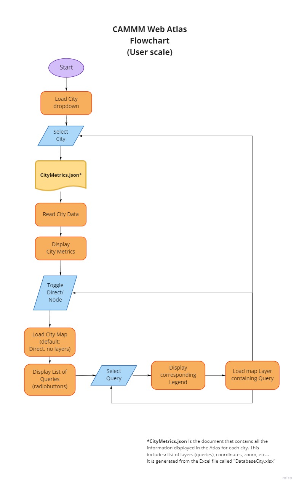

  #### City Catalogue Update Flowchart:
  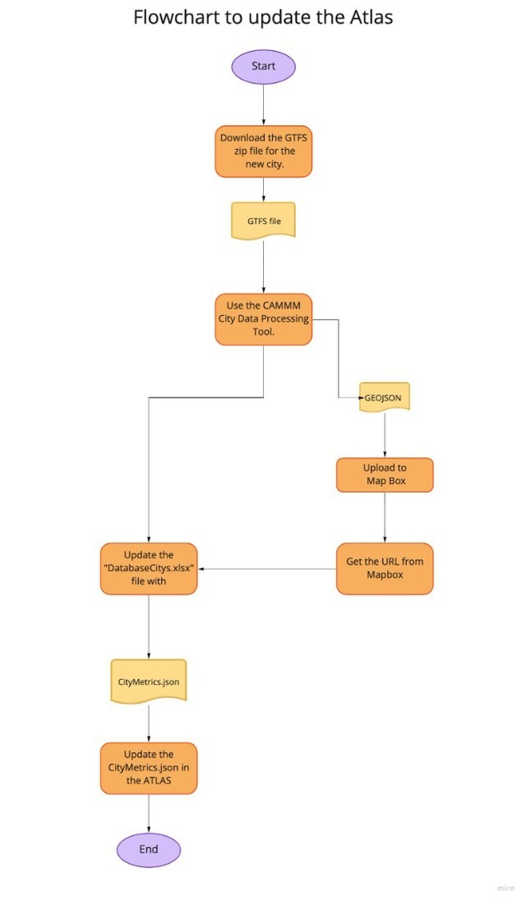

  #### CAMMM Atlas Info Pop-Ups:
  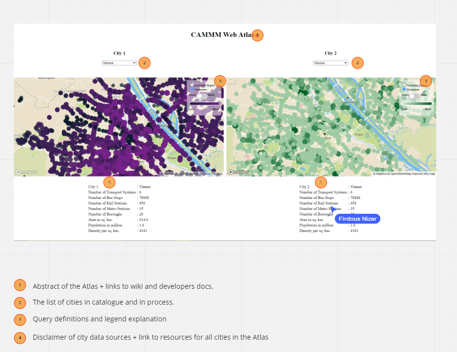

  #### For next session 

  **CAMMM Web Atlas Updates**

   - ~~align mapboxes and menu items of both cities~~
   - ~~make wireframe with named menu items~~
   - move print and export citation buttons at top right corner, one below the other
   - test a collapsable text box for citations
   - short description on WP project page
   - more documentation for the entire process so far
   - ~~menu items: increase font and space them out~~
   - piecharts for distribution of stops, line and dist. between stops for each transit system

  #### For next month:
   - figure out graphical representation of city metrics
   - density grid analysis to be added in queries
   - add button to download excel of metrics (tbd)
   - integrating businesses data points for each city and adding them to metrics

  

----------------------------------------------------------------------