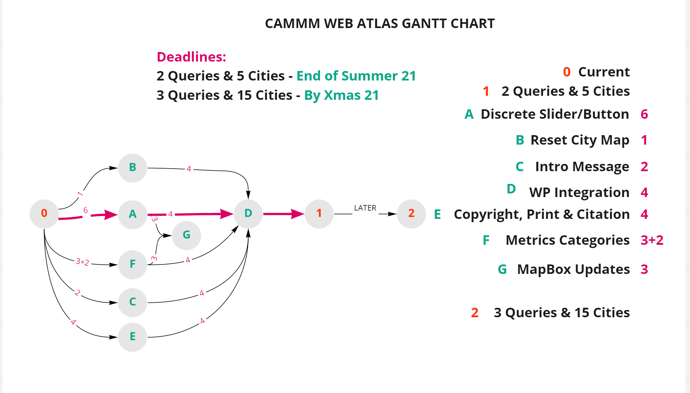

**Here is the link to see the website proper:**
https://spatialretrace.github.io/CAMMM-Web-Tool/

### Preview:

### CAMMM Atlas Gantt Chart Summer 2021:

### User scale Flowchart:

### City Catalogue Update Flowchart:

### CAMMM Atlas Info Pop-Ups:

Style URL example
mapbox://styles/carmela-cucuzzella/ckguxoar50i7w19qyf3c6qsdg

Share style
Preview 
https://api.mapbox.com/styles/v1/carmela-cucuzzella/ckguxoar50i7w19qyf3c6qsdg.html?fresh=true&title=view&access_token=pk.eyJ1IjoiY2FybWVsYS1jdWN1enplbGxhIiwiYSI6ImNrZThua3M2djF0MmkzMnFodmlncjU1MzUifQ.kQ7CmjkzU5V5-sY7WFkzmg

Live Sessions
vscode://vscode.github-authentication/did-authenticate?windowid=1&code=b87a0d598540f66dc6a0&state=72a208f8-8603-4f6f-8e12-5f68fe576911

#TODO
· Add the cumulative slider under the existing slider
· Make the text in the box larger
· Do content sentitive graduations [for the scale]
· Move controls to the lower part 
· Remove the titles of City 1 and City 2
· Put the Icon at the end of the described objects
· Clear the city metrics
· Next meeting on the 27th of August

·Remove the background from the table, background=none
·Direct & Cummulative we made font size 10 pixles 
·For the raido buttuons font size 10 and bold
·Also inside the table the bordar spacing is removed 
·For the slider labble the font is bold 
·Filter group height is set to 
