 # Currently working on: 
Make Inforgraphics interactive pages + embed on website - https://indd.adobe.com/view/60c23b28-eaec-4f56-bb1f-5b400a5b3296 
Keep working on Documentation - Section 2 Processing Tool - Work on flowcharts for each Operational and Analysis function 
Flowchart cheatsheet - https://www.breezetree.com/articles/flow-chart-symbols  https://www.conceptdraw.com/examples/flowchart-symbols-cheat-sheet
Fix indentation in markdown numbered list
Finish standalone mode for multi-browser solution (see indexStandalone HTML) https://www.w3schools.com/js/js_window.asp

Add this note to the docs: Direct is now Individual and Node is now Cluster.
#### CAMMM Web Atlas Tool
https://github.com/ideas-be/CAMMM-Web-Tool/
**Here is the link to see the website proper:**
https://ideas-be.github.io/CAMMM-Web-Tool/
**Here is the link to the Miro board:**
https://miro.com/app/board/o9J_kgmIpbw=/
#### Preview:
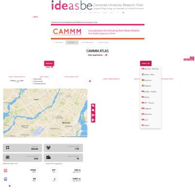

----------------------------------------------------------------------
  
# Documentation:
<!-- TABLE OF CONTENTS (WIP) -->

  
Table of Contents

  <ol>
    <li>
      <a href="#about-the-project">About</a>
      <ul>
        <li><a href="#ideas-be">IDEAS-BE</a></li>
        <li><a href="#cammm-project-web-atlas">CAMMM Project & Web Atlas</a></li>
        <li><a href="#contributors">Contributors</a></li>
        <li><a href="#license-funding">License & Funding</a></li>
        <li><a href="https://www.gnu.org/licenses/gpl-3.0.en.html">GNU General Public License v3.0</a></li>
      </ul>
    </li>
    <li>
      <a href="#getting-started">Section 1 - Getting Started</a>
      <ul>
        <li><a href="#software-requirements">Software Requirements</a></li>
        <li><a href="#how-to-write-docs">How to write the documentation</a></li>
        <li><a href="#useful-links">Useful Links</a></li>
      </ul>
    </li>
    <li>
      <a href="#processing-tool">Section 2 - Processing Tool</a>
      <ul>
        <li><a href="#use-proc-tool">Uses of the Processing Tool</a>
         <ul>
          <li><a href="#gtfs-processing">Process GTFS Files</a></li>
          <li><a href="#xls-to-json">Convert Excel to JSON</a></li>
         </ul>
        </li>
        <li><a href="#data-collection">Data Collection</a></li>
        <li><a href="#op-functions">Operational Functions</a></li>
        <li><a href="#queries-key-functions">Analysis Queries & Functions</a></li>
        <li><a href="#processed-data-mapbox">Processed Data for Mapbox & City Metrics</a></li>
        <>
      </ul>
    </li>
    <li>
      <a href="#using-mapbox">Section 3 - Using Mapbox</a>
      <ul>
        <li><a href="#create-city-map">Creating a City Map</a></li>
        <li><a href="#styling-map-layers">Styling Map Layers</a></li>
        <li><a href="#integrate-web-atlas">Integrating to Web Atlas</a></li>
      </ul>
    </li>
    <li>
      <a href="#model-city-object">Section 4 - Modelling City Object(JS)</a>
      <ul>
        <li><a href="#city-metrics-data">City Metrics Data</a></li>
        <li><a href="#city-object-parameters">Parameters</a></li>
        <li><a href="#city-object-functions">Functions</a></li>
      </ul>
    </li>
    <li>
      <a href="#develop-atlas-ui">Section 5 - Developing the Web Atlas UI</a>
      <ul>
        <li><a href="#ui-layout-html">UI Layout in HTML</a></li>
        <li><a href="#script-web-atlas">Scripting the Web Atlas</a></li>
        <li><a href="#styling-manual">Styling Manual</a></li>
      </ul>
    </li>
    <li>
      <a href="#appendix">Appendix</a>
      <ul>
        <li><a href="#appendix-a">Appendix A - Maintaining GitHub Repo & Page</a></li>
        <li><a href="#appendix-b">Appendix B - Managing Development Workflow</a></li>
        <li><a href="#appendix-b">Appendix C - Troubleshooting</a></li>
      </ul>
    </li>
  </ol>

----------------------------------------------------------------------

## About

  

  
  ### IDEAS-BE
  
  

  #### Mandate 
The **Concordia University** Research Chair in *Integrated Design, Ecology And Sustainability for the Built Environment* (ideas-be)  focuses on the study of design projects and practices for the built environment situated at the crossroads of cultural, social, environmental and economic concerns. It considers sustainability as a paradigm crossing the main disciplines and professions concerned with design for the built environment (urban design, architecture, and landscape). This research program identifies, categorizes and disseminates strategic transformations of sustainable intentions in the design of the urban built environment. Our main objective is to better understand how designers go beyond current injunctions of environmental norms and policies in order to achieve a creative balance between design ethics and aesthetics in their public space projects – a question that has remained largely unaddressed in recent design theory. 
How can current imperatives of responsible and ecological design in the urban built environment engender productive shifts in design theory and practice and in design methods and creativity? ​ 
The overarching goal of this CURC research project is to take a leadership role and ensure a central active figure in ongoing discussions and initiatives surrounding the sustainable design of the built environment. The four main scientific and pedagogical objectives are: 
 - Conduct fundamental research on sustainability and design for the urban built environment;
 - Create new pedagogical programs and courses (at undergraduate and graduate levels);
 - Build a Living Lab for sustainable urban space ideation and design;
 -  Develop international and national collaborations.

  

  

  
  ### CAMMM Project & Web Atlas

  

  Welcome to the **CAMMM Atlas Web Application**, developed by **IDEAS-BE** (*Integrated Design and Sustainability for the Built Environment*). This tool is a work-in-progress and part of the research project titled, **CoLLaboratoire for Activating Multi-modal Mobility (CAMMM): One Public Space at a Time**, in order to compare the transit systems between each city and critically reflect on mobility in the city. 
  
  #### Abstract: 
   The CAMMM Atlas web application contains a comparison atlas of public transit networks between cities. This atlas includes morphological, geographic-topological, and network analysis concepts that enable users to understand the current status and potential of different transit networks. The underlying aim for this application is to facilitate research on the domain of public transit mobility and urban form. The resulting research seeks to encourage discussions and developments of the ways multimodality plays a role in the way citizens move around urban spaces. This abstract offers a methodological description and rationale of the indicators and queries developed for the CAMMM Atlas web application.  
  Currently, the atlas covers a selection of cities that fit a pre-defined list of parameters. This list is intended to grow as more public transit data becomes available. In order to develop an international comparative tool, this research uses public transit data provided by the government websites of each analyzed city in the format of General Transit Feed Specification (GTFS)1. The data extracted from this resource includes transit services, stops, stations, routes, trips in routes, and schedules for the trips; among other variables depending on local conditions.   
  For the analysis, each metro station, bus/tram stop or other point of access to the transit network is treated as an individual object, i.e., node. The collection of all nodes and their relationships build the entire transit network. This network is the object of our research queries explored in the atlas.  
  Drawing from morphological, geographic, and network analysis studies, the current queries provided by the atlas are: (1) shortest path or betweenness centrality, (2) closeness centrality, (3) Eigen-vector centrality, and (4) average distance to nearest neighbor. (1) Betweenness centrality is associated with how accessible the rest of the network is, with respect to a given node. This means that this query evaluates the ease of a trip from the given node to any other point in the network and vice versa. (2) Closeness centrality measures the desirability of a given node in being included in a particular trip inside the network. A node with a higher value of closeness centrality will imply that it is more frequented during trips inside the network. (3) Eigen-vector centrality describes the relationship of a given node to other parts of the network that are well connected. This query brings to the forefront the nodes that are less frequented but have a high degree of influence in the network. (4) Average distance to nearest neighbor assesses the mean length of a trip between a given node and its immediately neighboring nodes inside the network. In the process of implementation, the Rotated Grid analysis describes the density of bus/tram stops and metro/train stations across the built environment, following the natural angle of the urban fabric. Further queries will be added as they are implemented in the application. 
  The atlas is developed as an analysis tool to be used by a variety of researchers, policymakers, and local authorities.  Policymakers and local authorities could potentially use the atlas to compare implementations of public transit approaches across different cities. Scholars and academics could potentially use the application to evaluate different urban spaces and their approaches to multimodal mobility. The atlas may also enable a better understanding of the relationship between the urban form, nodes of interest, and the public transit network. 

  
  

  

  
  ### Contributors

  **Lead of Project** 

  <a href="https://www.concordia.ca/finearts/design/faculty.html?fpid=carmela-cucuzzella">Dr. Carmela Cucuzzella, Ph.D.</a> [Professor, Design and Computation Arts; Concordia University Research Chair in Integrated Design And Sustainability for the Built Environment (IDEAS-BE); Founding Co-Director, Next Generation Cities Institute] 

  **Author Information**

  - Carmela Cucuzzella is lead coordinator of the Atlas Web Application and surrounding technical infrastructure.  

  - <a href="https://www.concordia.ca/faculty/pierre-gauthier.html">Pierre Gauthier</a> is advisor on urban morphological aspects of each city represented on the atlas. 

  - <a href="https://ideas-be.ca/student/omar-ortiz-meraz/">Omar Ortiz Meraz</a> is the back end and lead GIS programmer for all queries displayed on the atlas. 

  - <a href="https://ideas-be.ca/student/firdous-nizar-phd/">Firdous Nizar</a> is the lead front end developer for the web application interface. 

  

  

  ### License & Funding
  CAMMM Atlas Web Application 
  Copyright (C) 2022, Carmela Cucuzzella 
  
  This program is free software: you can redistribute it and/or modify 
  it under the terms of the GNU General Public License as published by 
  the Free Software Foundation, either version 3 of the License, or 
  (at your option) any later version. 
  
  This program is distributed in the hope that it will be useful, 
  but WITHOUT ANY WARRANTY; without even the implied warranty of 
  MERCHANTABILITY or FITNESS FOR A PARTICULAR PURPOSE. See the 
  GNU General Public License for more details. 
  
  You should have received a copy of the GNU General Public License 
  along with this program. If not, see <a href="https://www.gnu.org/licenses/">https://www.gnu.org/licenses/</a> 

  ##### GTFS Licensing

  DISCLAIMER: The data shown in the atlas reflects the information provided in GTFS format by the transport agencies managing the public transit locally in each city. These files are obtained from the official websites corresponding to each city, or internet aggregators. Therefore, accuracy of the data displayed is out of the scope of this research tool. The authors cannot guarantee the precision of this data. 

  ##### Funding Details

  **Project:** <a href="https://ideas-be.ca/project/collaboratoire-for-activating-multi-modal-mobility-one-public-space-at-a-time/#research-funding">CoLLaboratoire for Activating Multi-Modal Mobility: One Public Space at a Time </a>
  **Funding:** Social Sciences and Humanities Research Council of Canada (SSHRC) Partnership Development Grant [890-2018-0025]

  **List of GTFS Sources:**

  DISCLAIMER: The data shown in the atlas reflects the information provided in GTFS format by the transport agencies managing the public transit locally in each city. These files are obtained from the official website corresponding to each city, or internet aggregators. Therefore, accuracy of the data displayed is out of the scope of this research tool. The authors cannot guarantee the precision of this data. 

   - Montreal  | Montreal-Société de transport de Montréal. <a href="https://www.stm.info/en/about/developers/terms-use">
   - Quebec    | Le Réseau de transport de la Capitale (RTC). <a href="https://www.rtcquebec.ca/donnees-ouvertes">
   - Vienna    | Open Data Österreich. <a href="https://www.data.gv.at/katalog/dataset/wiener-linien-fahrplandaten-gtfs-wien">
   - Barcelona | Transports Metropolitans de Barcelona. <a href="https://developer.tmb.cat/data">
   - Budapest  | The Centre for Budapest Transport and open mobility data. <a href="https://data.europa.eu/en/news/centre-budapest-transport-and-open-mobility-data">

  

----------------------------------------------------------------------

## Section 1 - Getting Started

  

  ### Software Requirements

  

  
  

  ### How to write the documentation

  

  
  

  
  ### Useful Links

  #### Mapbox
  **Style URL example**
  mapbox://styles/carmela-cucuzzella/ckguxoar50i7w19qyf3c6qsdg
  
  

        

----------------------------------------------------------------------

## Section 2 - Processing Tool

  The CAMMM Atlas web application makes use of a Processing Tool to manage the data that goes into the creation and maintenance of the city maps. This python-based tool is to be used by the development team to process large amounts of city data into relevant file formats that could be read and displayed onto the atlas web application. 
   The processing tool must be used when a new city needs to be added to the atlas, using the GTFS data for the respective city.

  

  
  ### Uses of the Processing Tool

  The main two uses of the Processing Tool are, (1) to process the data in each city's GTFS files for MapBox and (2) to convert the metrics of each city from the main Excel file to the JSON format for the web application. The following subsections take a closer look at each of these uses.

  
 
  
  #### Process GTFS Files

*What are GTFS files?*

 The <a href="https://gtfs.org/">General Transit Feed Specification (GTFS)</a> is a data specification that allows public transit agencies to publish their transit data in a format that can be consumed by a wide variety of software applications. 
GTFS is split into a static component that contains schedule, fare, and geographic transit information and a real-time component that contains arrival predictions, vehicle positions and service advisories. For further information, please consult <a href="https://developers.google.com/transit/gtfs">Google Developer documentation</a> on GTFS.
 

*What data from these files is used in our project?*
 The list of files from GTFS needed to run the Processing Tool are:
Agency, Routes, Trips, Stop_times, Stops, and Shapes. 
These files are <a href="https://developers.google.com/transit/gtfs/reference#fare_attributestxt">mandatory</a> components that make up a GTFS specification. The information necessary to construct the transit system networks is distributed these listed files.
 

*How is this data processed?*

 The data is done in the following steps:

1. De-compress the GTFS files
2. Read information from these files: Agency, Routes, Trips, Stop_times, Stops, and Shapes.

  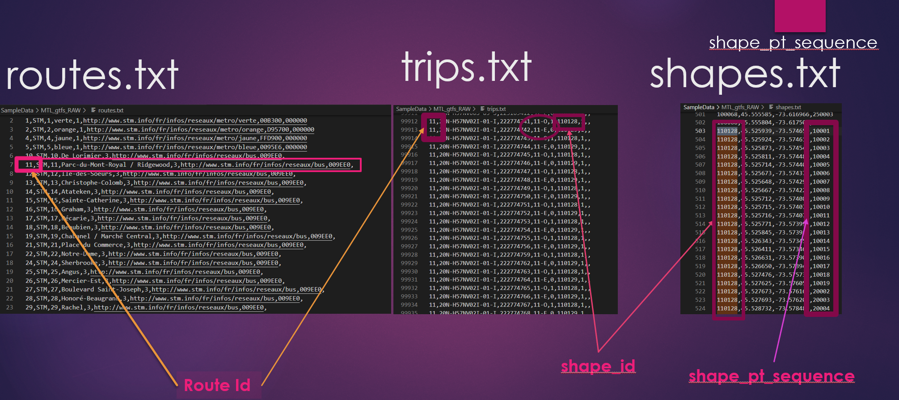

3. The geographic data is transformed from WGS84 to local UTM coordinates.
4. Store the read data in their corresponding UTM zone in a Network Object.
5. Perform the analysis (queries)
     5.1. Perform the network analysis calculations at an Individual network
     5.2. Cluster the objects into Nodes and Supernodes.
     5.3. Perfom the network analysis calculation with the Nodes and Supernodes.
     5.4. Obtain the average distances between stops per transit system.
     5.5. Perfom the rotated grid density analysis on the transit network.
6. Transform the data from local UTM zone back to WGS84.
7. Store the data in geojson file(s) for MapBox.

 

  
 
  
  #### Convert Excel to JSON

  *What does the CAMMM excel contain?*

Click to see contents

  
  

| Item              | Sub Item     | Row | Description                                           |
| ----------------- | ------------ | --- | ----------------------------------------------------- |
| City              |              | A   | English name of the city                              |
| name              |              | B   | Local name of the city                                |
| DirectStyleURL    |              | C   | Mapbox URL of the Individual analysis map             |
| NodeStyleURL      |              | D   | Mapbox URL of the Clustere analysis map               |
| Coords            | Lat          | E   | The latitude values of the center of the city         |
|                   | Lon          | F   | The longitud values of the center of the city         |
| Zoom              |              | G   | The initial zoom value of the city map                |
| NumTransitSystems |              | H   | The total number of transit systems in the city       |
| NodeLayers        |              | I   | The list of layers for Cluster analysis               |
| Bus               | DirectLayers | J   | The list of Bus layers for Individual analysis        |
|                   | NumStops     | K   | The number of Bus stops                               |
|                   | NumLines     | L   | The number of Bus lines                               |
|                   | AvgDisStops  | M   | The average distance between Bus stops                |
| Train             | DirectLayers | N   | The list of Train layers for Individual analysis      |
|                   | NumStops     | O   | The number of Train stations                          |
|                   | NumLines     | P   | The number of Train lines                             |
|                   | AvgDisStops  | Q   | The average distance between Train stops              |
| Metro             | DirectLayers | R   | The list of Metro layers for Individual analysis      |
|                   | NumStops     | S   | The number of Metro stations                          |
|                   | NumLines     | T   | The number of Metro lines                             |
|                   | AvgDisStops  | U   | The average distance between Metro stops              |
| Tram              | DirectLayers | V   | The list of Tram layers for Individual analysis       |
|                   | NumStops     | W   | The number of Tram stops                              |
|                   | NumLines     | X   | The number of Tram lines                              |
|                   | AvgDisStops  | Y   | The average distance between Tram stops               |
| Others            | DirectLayers | Z   | The list of Other layers for Individual analysis      |
|                   | NumStops     | AA  | The number of Other stops                             |
|                   | NumLines     | AB  | The number of Other lines                             |
|                   | AvgDisStops  | AC  | The average distance between Other stops              |
| NumBoroughs       |              | AD  | Number of Boroughs in the city                        |
| AreaSqKm          |              | AE  | Area of the city in square kilometers                 |
| PopulationMillion |              | AF  | Total population of the city in millions              |
| DensityPersonSqKm |              | AG  | Density of people in the city per square kilometer    |
| YearOfStats       |              | AH  | Most recent year of statistics available for the city |
| SourceGTFS        |              | AI  | Source URL of the city's GTFS file                    |
| DateUpdatedGTFS   |              | AJ  | Date when the GTFS file was collected                 |

 
 This excel file should contain general descriptors of each city and their local transit systems. For example, 'YearOfStats' ensures that we attribute which year these city statistics were updated by their respective sources. This excel is a live document that could expand with data entries that are relevant to the city's transportation systems and should be updated on a regular basis. Remember, any modifications of this excel will not affect the atlas's functionality **UNLESS** it is converted into a <a href="https://developer.mozilla.org/en-US/docs/Learn/JavaScript/Objects/JSON">JSON (JavaScript Object Notation) file</a>, which is required for the web implementation of the atlas. Hence, changes on the excel will reflect on the .JSON file **ONLY** through the use of the Processing Tool. 
 

  *Why JSON?*
 
   The atlas integrates .JSON file for the city data because we are using JavaScript to code all functionality of the atlas UI, and <a href="https://www.w3schools.com/js/js_json.asp">Javascript works well with JSON</a>. We recommend the creation of the .JSON file with the Processing Tool. This is because no modifications should be done directly on the .JSON file as they will **NOT** be reflected back on the main city excel. Therefore, all city data are recommended to be maintained within the excel and then converted to .JSON solely for web integration purposes.   

  *How is the conversion done?*
 
 The conversion from Excel to JSON is done through the following steps:
1. Read the data from main city Excel file:  
  1.1. Get the path of the Excel file  
  1.2. Pass the path value to the ReadFile function  
  1.2.1. Populate a dictionary with column names and values of the Excel to the corresponding JSON items  
    1.2.2. Declare an exit dictionary to be returned to the ReadFile function  
    1.2.3. Open the Excel file using the path variable  
    1.2.4. Read the sheets in the Excel file  
    1.2.5. Obtain the number of rows  
    1.2.6. Run a loop through each row:  
      1.2.6.1. Prepare the data to be stored in the JSON format  
      1.2.6.2. Store the data in the exit dictionary variable (see 1.2.3.)  
    1.2.7. Return the exit dictionary  
2. Write the data to JSON file:  
   2.1. Get the Output path for the *'CityMetrics.json'*  
   2.2. Pass the exit dictionary returned from the ReadFile function, and the JSON path  
      2.2.1. Create *'CityMetrics.json'* file  
      2.2.2. Encode and write the data from exit dictionary to JSON file  
      2.2.3. Close the JSON file    

  

  
  

  
  

  
  ### Operational Functions
These functions allow for the processing tool to prepare the data that will be used for different stages of the atlas analyses. The main list of operational functions are: 
Function 1 : Prepares the data of several cities to be held in a single file. DONE
Function 2 : Converting Excel to JSON file.

  

  
  

  
  ### Analysis Queries & Functions
  *insert para on intro to analysis queries for the cammm tool*

  #### Geometrical Analysis
  *insert an intro to geometrical analysis before types*

  ##### Types of Geometrical Analysis
  **1. Distance between stops ||| Distribution Degree**

  #### Centrality Analysis
  *insert an intro to centrality before types*
  
  ##### Types of Centrality
  **1. Betweeness Centrality ||| Centrality Degree**
$C_{B}(v)$ = $sum_$
  **2. Closeness Centrality ||| Closeness Degree**

  **3. Eigen Vector Centrality**

  #### Density Analysis
  *insert an intro to rotated grid density analysis before types*

  ##### Types of Density Analysis
  **1. Mass Transit Density Analysis**

  **2. Amenities & Services Density Analysis ||| TOD Degree**

  

  
  

  
  ### Processed Data for Mapbox & City Metrics

  

----------------------------------------------------------------------

## Section 3 - Using Mapbox

  
<a href ="https://en.wikipedia.org/wiki/Mapbox">Mapbox</a> is a provider of custom online maps for websites and applications. Inside of Mapbox, it is possible to manage geospatial data and design custom map styles.

   Mapbox is the creator of, or a significant contributor to, some open source mapping libraries and applications. Mapbox uses anonymised data from geolocation services such as OpenStreetMap, Strava, RunKeeper, etc.
   
   We use Mapbox to host the processed data from the selected cities. This is done using the Mapbox <a href="https://studio.mapbox.com/">Studio</a> using the IDEAS-BE credentials. Each city map is called a <em>Style</em> inside of Mapbox and all the data is stored in form of <em>Tilesets</em>. The upload format is a custom version of Geo-JSON. (Check <a href="#appendix-b">Appendix B</a> for example.) The processing software delivers in ready to be uplodaded files.
  
  

  ### Creating a City Map
  The mpas that contatin all the processed data for each city are created following these 2 main steps:

    TL//DR
    - Upload the necessary .geojson files as _Tilesets_ in Mapbox

    - Create a new style 
    
  -------------------------------------------------------------
  
  The city maps in MapBox are made by creating a Style and then uploading the corresponding Tileset for the map using drag and drop. To make the Tileset, the <a href="#processing-tool">Processing Tool</a> needs to be used.
   
  
  **Steps to upload the map:**

    - In the MapBox Studio, go to the Tileset section and select New Tileset.
  
  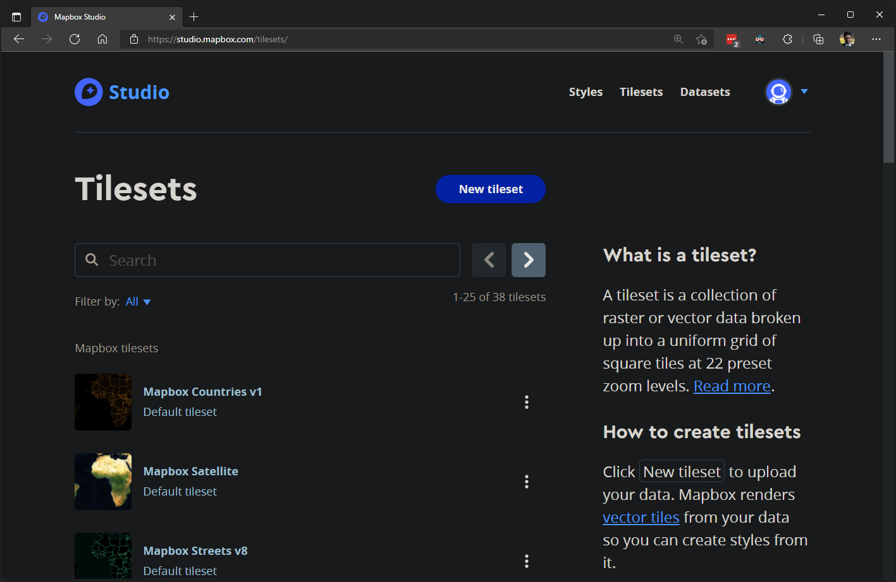

    - Upload the file containing the data you wish to display on the map.
  
  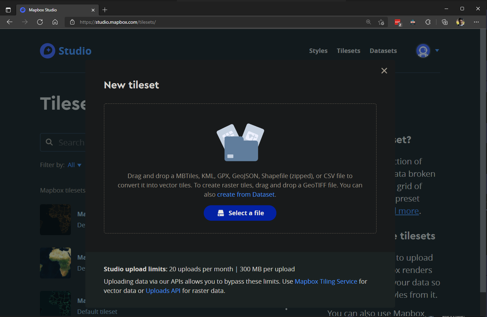

  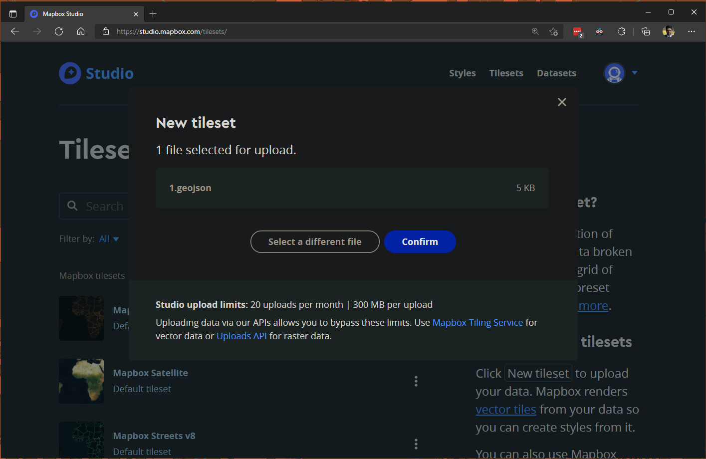

    - The upload will report success on the bottom right corner of the website. (see Troubleshoot section if the upload fails)

  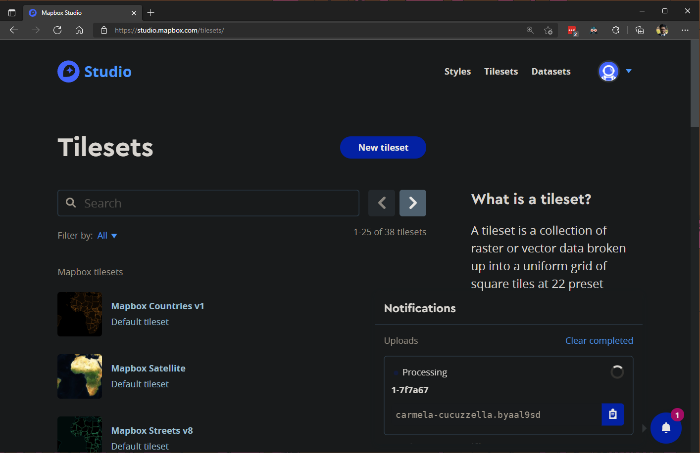

    - Once all the data is in Tileset a new map can be created. Inside of Mapbox, the Styles are the 'maps'.
    - Click the New Stule button.

  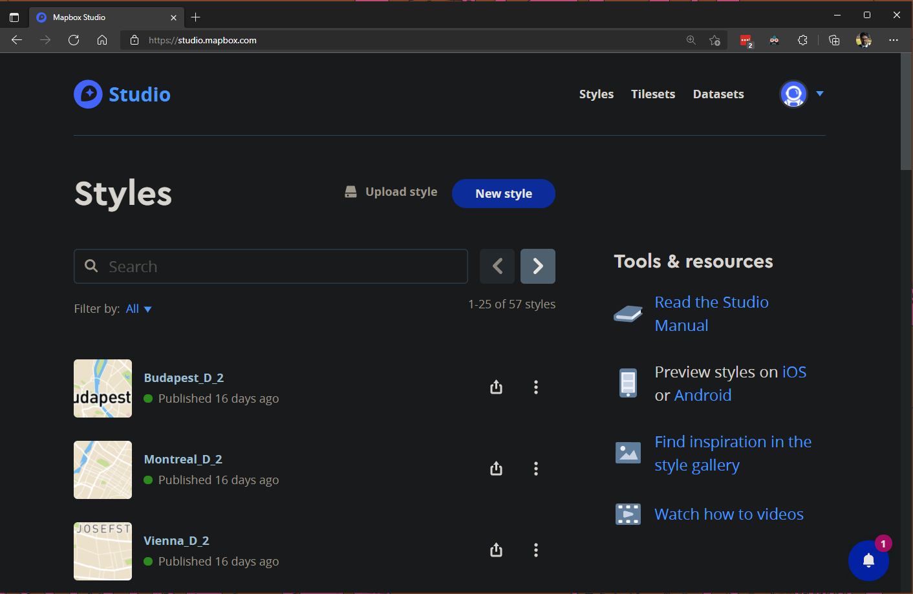

    - Select the appropriate temple, for this project we have used the 'Basic' as is.

  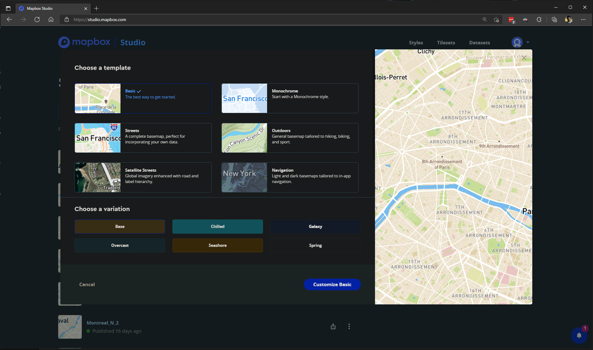

    - Once you landed on the map, you have to go to the plus icon on the top left side. There you will add the Tileset with the processed data.

  

    - An alternative list of the tileset already loaded can be seen by changin from Components to Layers in the top left side.

  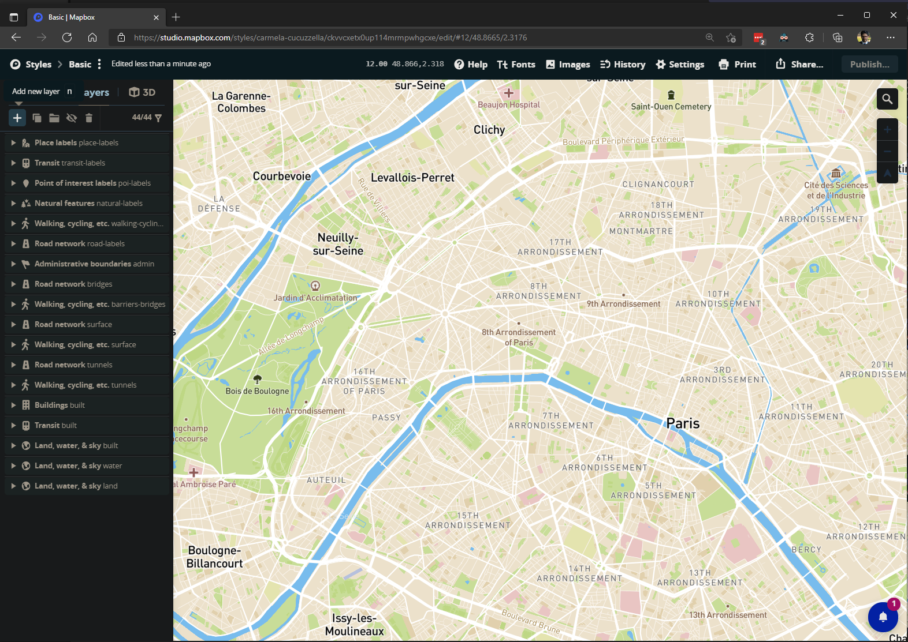
  
    - After pressing the plus button (top-left), in the Source section you click on the 'None Selected'.

  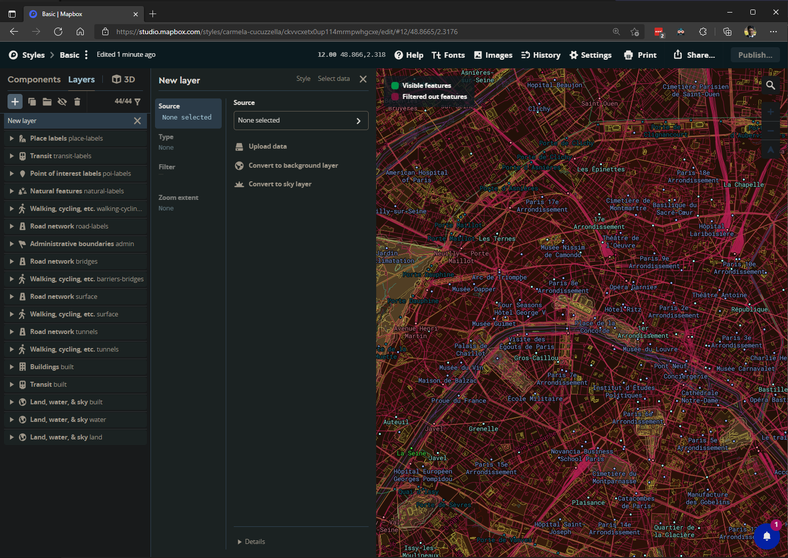

    - Navigate to the desired Tileset, you may also use the search bar with the name of the Tileset.

  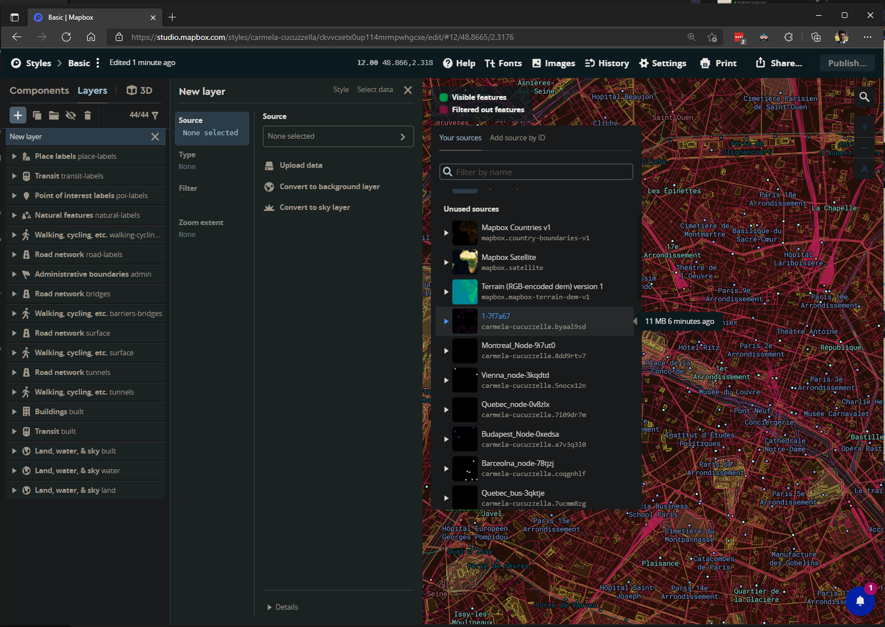

    - Change the Type as needed. View style guidelines for layer maps. 

  

  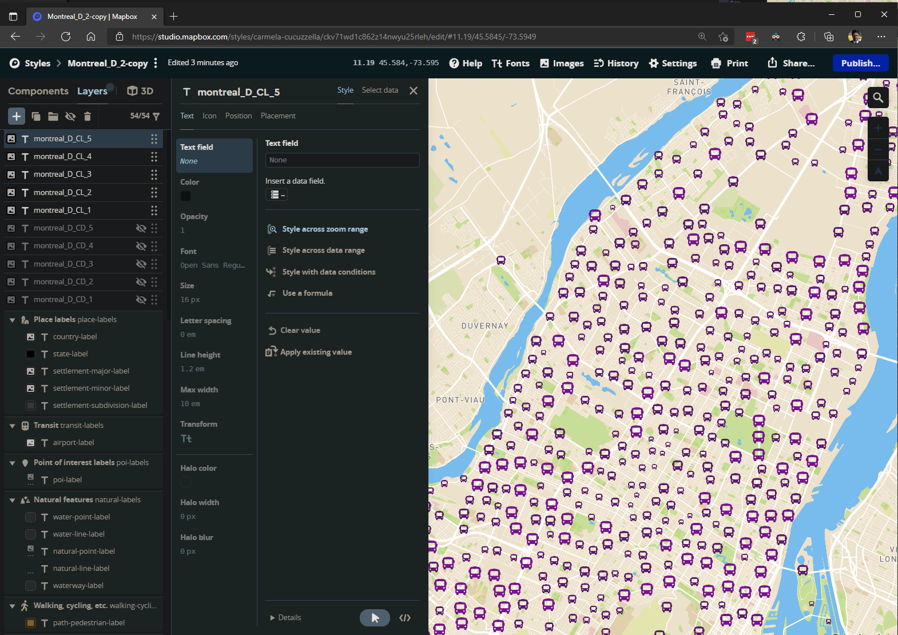

  

  

  

  
  ### Styling Map Layers

> What is a style? 
> A Mapbox style is a JSON object that defines exactly how a map should be drawn. It defines almost everything related to a map's appearance. Every map depends on a style, so when you change a map style, any map that uses that style will be affected by your changes upon its next load.
>Style layers give sources a visual appearance by specifying which layout and paint properties Mapbox GL should apply. These properties include colors, fonts, line widths, layer order, and more.

 For the Mapbox documentation click <a href="https://docs.mapbox.com/help/getting-started/map-design/#what-is-a-style">here</a>.

 The styling of the uploaded layers containing the layers that compose the atlas must follow one of the folloing guides:

 #### Discrete layer (five categories):  

  The atlas uses a series of predefined *Icons* for each catergory in each of the five types of transit systems the atlas includes. These are customized versions from the <a href="https://fontawesome.com/v5.15/icons/bus?style=solid">FontAwesome</a>. These are modified using a vector-based software such as InkScape or Adobe Illustrator. Each specific category layer of a transit system displays the corresponding icon in a color gradient that represents the value of that datapoint. The gradient goes from *very high* to *very low*. 

  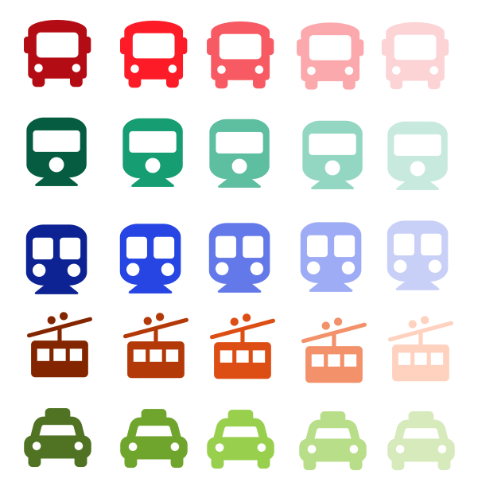
  
  For example, the *Bus* transit system in its *low* category is represented with the color 
#fca9adff

  The current icon and color shceme can be found in the Teams folder (see <a href="#software-requirements">Section 1</a>):  
  >CAMMMM Web Atlas 0.1 > Production > <a href="https://teams.microsoft.com/_#/school/files/CAMMM%20Web%20Atlas?threadId=19%3A2234b6cfce40493aa81f7ff81b9143cc%40thread.tacv2&ctx=channel&context=Icons&rootfolder=%252Fteams%252FCAMMM%252FShared%2520Documents%252FCAMMM%2520Web%2520Atlas%25200.1%252FProduction%252FIcons">Icons</a>

  The following example shows how the layer named *montreal_D_CL* is styled. For the layer to have the functionality in the atlas it needs to be replicated five (5) times, each one of the copies corresponding to one category of the analysis.  

  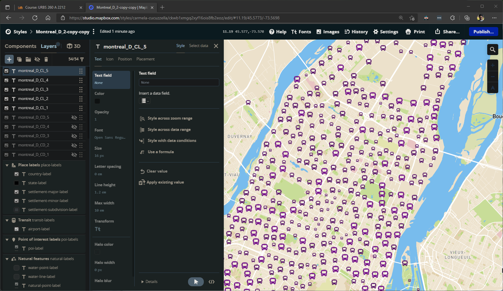  
  
   The workflow to add a custom icon requires the user to (1)set the desired variable to be mapped, (2)set the data condition for the category of the variable to be mapped and, (3)uplod the custom icon image file. These are the following steps in the workflow: 

   - First, you have to select the **Icon** tab under the name of the layer. This tab is located in between the *Text* and *Position* tabs.
  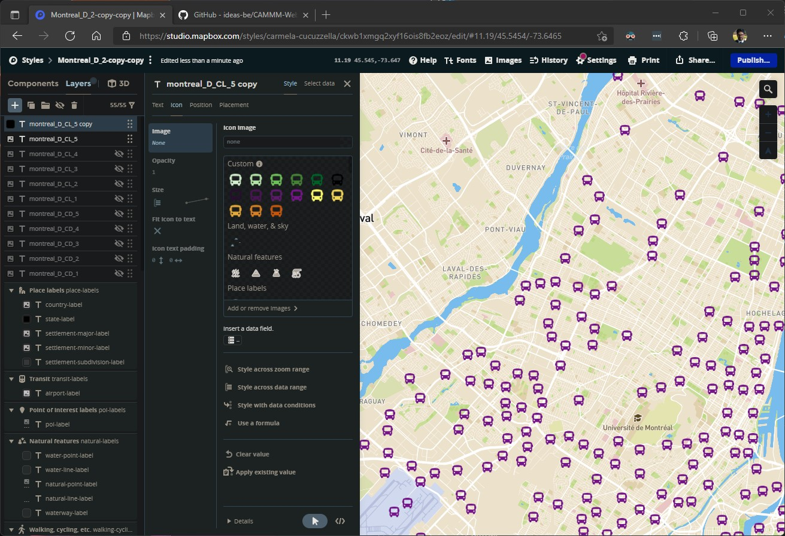  

   - Once in the Icon tab, you select **Style with data condition**.
  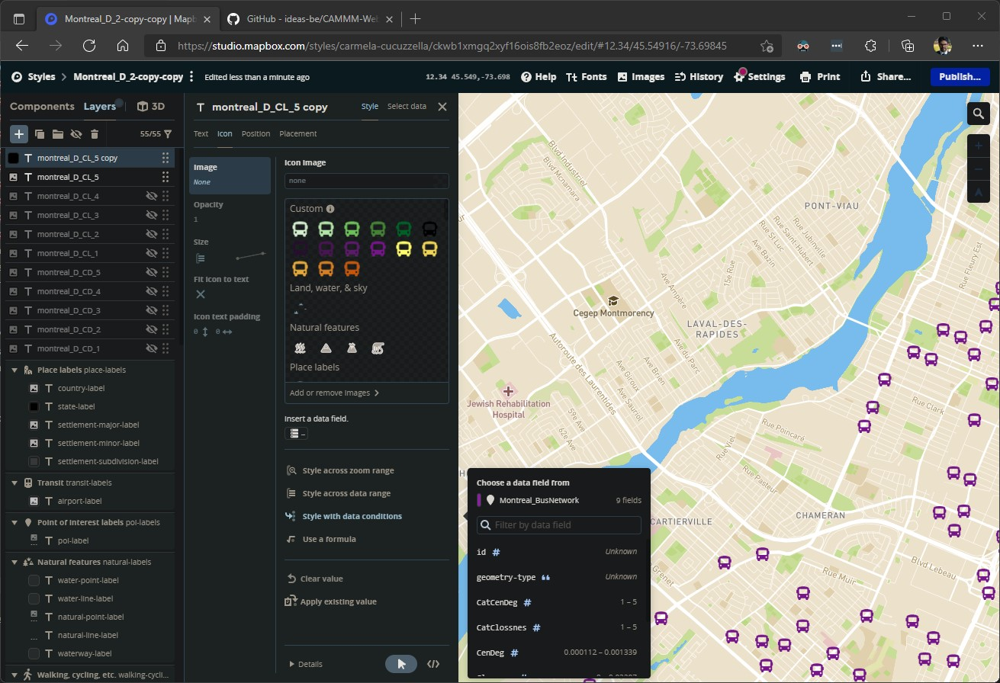 
  
   - In the pop-up that appears, you select the variable&mdash;in this case, CatClossnes&mdash;to map. In the following pop-up that appears in the top right, you select the corresponding value that will be listed&mdash;in this case, 3.
  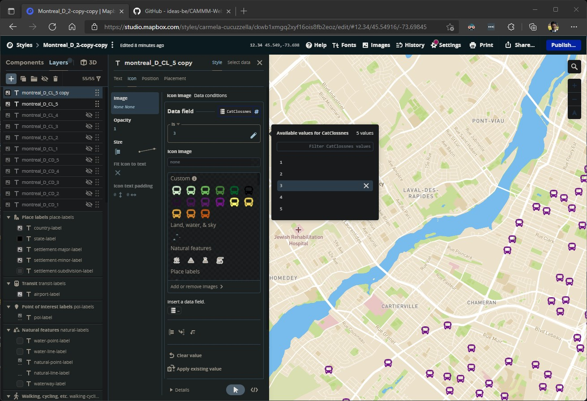 
  
   - Finally, to upload the custom icon image to this category, you navigate to the *Image* section under the Icon tab and select the **Add or remove images** under *Custom*. A new pop-up with the upload button will appear.
  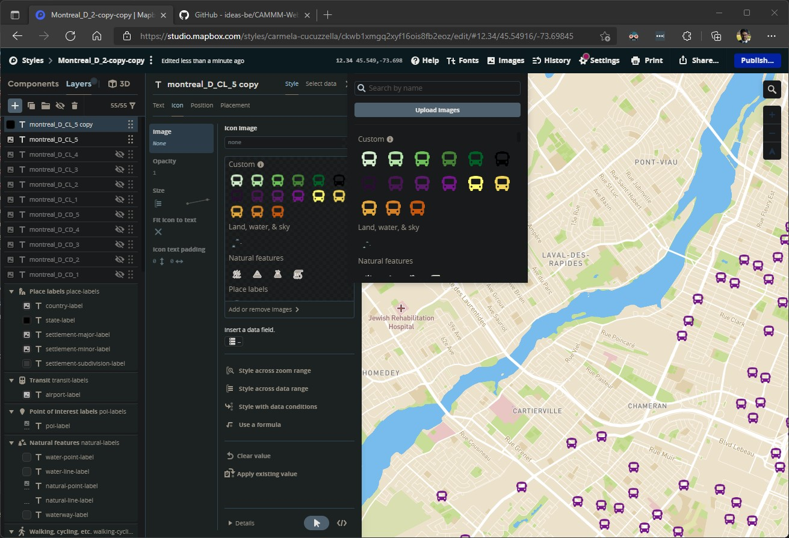 

<!-- WORK MORE ON STYLING FOR EACH INDIVIDUAL LAYER -->

  

  
  

  
  ### Integrating to Web Atlas
 
 The MapBox is integrated into the UI of the CAMMM Atlas Web Application as follows:
 -Ensure that the map created in MapBox Studio has been _published_
 -Go to the Embed menu and copy the **Style URL** associated with the map
  Here is a sample syntax of the URL: _mapbox://styles/**user-name**/**style-url**_

  

  

----------------------------------------------------------------------

## Section 4 - Modelling City Object(JS)

  

  ### City Metrics Data

  

  

  ### Parameters

  

  

  ### Functions

  #### ORDER of functions inside City object

  0. (98)constructor - Called when -the city object is created- where -inside the city object-
  1. (111)readCityJson
  2. (124)loadMap
  3. (143)injectDirectNodeToggleHTML
  4. (156)getDirectNodeToggle
  5. (180)injectRadioButtons
  6. (194)getRadioStatus
  7. (208)injectCatCumulToggleHTML
  8. (224)getCatCumulToggle
  9. (245)injectCumulSlider
  10. (269)injectCatSlider
  11. ()turnOffAllLayers
  12. ()loadCumulativeLayers
  13. ()loadCategoryLayer
  14. ()displayCityMetrics

  #### Flow of functions inside **City.JS**

  1. **readCityJson**
      1. Stores the values for the coordinates and the zoom in the city object from the JSON file

  2. **loadMap**
      1. create themapbox container
      2. initializes new map with the city ural, coordinates, and zoom
      3. injects the mapsbox to display city map

  3. **injectDirectNodeToggleHTML**
      1. inserts a unique Direct/Node HTML Toogle to each city
      2. on change it calls the function getDirectNodeToggle and passes the status of the toogle

  4. **getDirectNodeToggle**
      1. The variable selAnalysis,
      2. Reads the values for the URL and list of layers, dependeing on the Value of selAnalysis (status of Toggle)
      3. if selAnalysis is True, then the cityURL and ListofLayers are read from **node** values inside Json object
      4. else, cityURL and ListofLayers are read from **direct** values inside Json object
      5. the functions loadMap and injectRadioButtons

  5. **Inject Radio buttons**
      1. the function takes city num and list of layers 
      2. initialize an hmtl variable that contations the injected radio buttons
      3. NameOfQueries is list of queries applied to the cities, it contains the names (of queries)
      4. a loop then goes thorugh the list of layers and display them as radio buttons
      5. inside the loop the radio buttons are injected, when clicked they call two functions: getRadioStatus and injectCatCumulToggleHTML

  6. **getRadioStatus**
      1. a new arry is created, called radioList, it takes the status value of the selected radio button 
      2. using a loop, radioList stores true or false values based on the selected radio buttons

  7. **injectCatCumulToggleHTML**
      1. inserts a unique Category/Cumulative HTML Toogle to each city
      2. on change it calls the function getCatCumulToggle and passes the status of the toggle

  8. **getCatCumulToggle**
      1. Read the toogle value and if True, inject Category Slider and load layers accordingly 
      2. else, the cumulative slider is injected and layers are loaded accordingly 

  9. **injectCumulSlider**
      0. Default position: For Cumul Slider, the head of the slider will be at the extreme right (highest value) to display all layers on map
      1. Based on the selected Query (Centrality or Closeness) the cumulative slider html is injected
      2. this slider contains values ranging from 1 to 5 with a step of one
      3. On change, the valirable: sliderValue from the city object gets the current slider value 
      4. The funcitons called are turn off all layerse and loadCumulativeLayers 

  10. **injectCatSlider** NO WRITTEN AT THE MOMENT OF DOCUMENTATION 

  11. **turnOffAllLayers**
      1. loops throught all layers and turns them off

  12. **loadCumulativeLayers**
      1.  loops the radio list with the status of the radio buttons, 
      2.  if radio button is true, it loops through the list of corresponding layers and truns them on **until the current slider value** (using the variable sliderValue of city object)

  13. **loadCategoryLayer**
      1. loops through all layers to find and turn on corresponding layer to current slider value 
      
  14. **displayCityMetrics**
      1. contains list of icons and stop types for  each transist systems
      2. inject html for citymetricTable, it contains the number of stops, the number of lines, and the average distance between stops

  

----------------------------------------------------------------------

## Section 5 - Developing the Web Atlas UI

  

  ### UI Layout in HTML

  

  

  ### Scripting the Web Atlas

  

  

  ### Styling Manual
  
  Colors
  - Hero Color - pink
  - Transport System
  - Grid Analysis
  - Node and SuperNode
    - Centrality Degree
    - Closeness Degree

  Typefaces
  - Primary
  - Secondary
  - Substitutes

  Icons
  - Basic UI/UX
  - Transport systems

  

----------------------------------------------------------------------

## Appendix

  

  ### Appendix A - Maintaining GitHub Repo & Page

  

  

  ### Appendix B - Managing Development Workflow  <!-- ### CAMMM Atlas Gantt Chart Summer 2021: -->
  #### User scale Flowchart:
  
  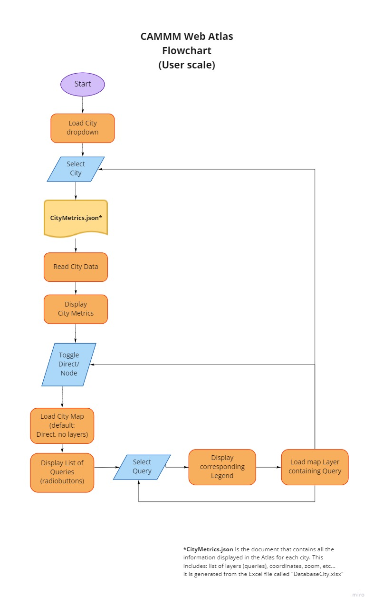

  #### City Catalogue Update Flowchart:
  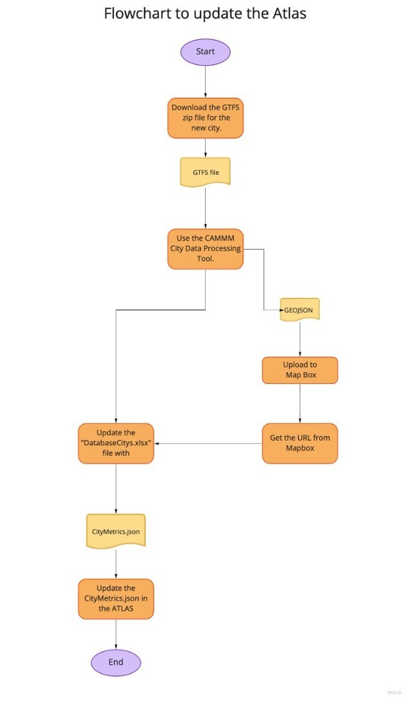

  #### CAMMM Atlas Info Pop-Ups:
  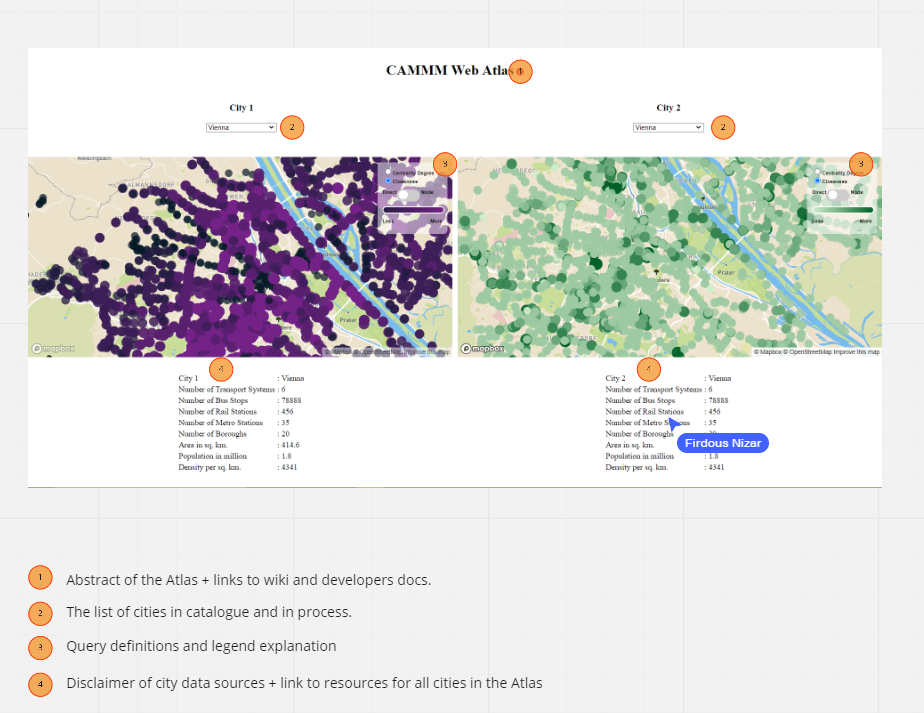

  

----------------------------------------------------------------------

# Scratchpad:
budapest ranges:
1-3, 4-11, 12-22, 23-39, 40-64

quebec ranges: 
1-4, 5-12, 13-21, 22-32, 33-50

vienna ranges:
1-4, 5-12, 13-22, 23-34, 35-57

barcelona ranges:
1-4, 5-15, 16-28, 29-42, 43-64

boston ranges:
1-3, 4-12, 13-25, 26-49, 50-83

longueuil ranges:
1-3, 4-11, 12-20, 21-30, 31-47

vancouver ranges:
1-2, 3-8, 9-16, 17-31, 32-58

COLORS FOR GRID
_grid_1
Level 1     ff8f00  
Level 2     eb6a00  
Level 3     db4900  
Level 4     e05200  
Level 5     c41900

Colors for Node Centrality
_N_CD_1

Level 1     d3eecd  
Level 2     b3e4a8  
Level 3     6dc25a  
Level 4     458337  
Level 5     006127

Colors for Node Centrality
_N_CL_1

Level 1     000000  
Level 2     2a0d30  
Level 3     4a1655  
Level 4     5b1b69  
Level 5     76158c 

DIRECT SIZE
Buses 0.7
Tram  1.0
Metro 0.8
Rail  0.8

INFO POP UP ONE TEXT
--------------------------
About
Welcome to the CAMMM Atlas Web Application, developed by IDEAS-BE (Integrated Design and Sustainability for the Built Environment). This tool is a work-in-progress and part of the research project titled, CoLLaboratoire for Activating Multi-modal Mobility (CAMMM): One Public Space at a Time, in order to compare the transit systems between each city and critically reflect on mobility in the city.

License
CAMMM Atlas Web Application
Copyright (C) 2022, Carmela Cucuzzella

This program is free software: you can redistribute it and/or modify 
it under the terms of the GNU General Public License as published by 
the Free Software Foundation, either version 3 of the License, or 
(at your option) any later version.

This program is distributed in the hope that it will be useful, 
but WITHOUT ANY WARRANTY; without even the implied warranty of 
MERCHANTABILITY or FITNESS FOR A PARTICULAR PURPOSE. See the 
GNU General Public License for more details.

You should have received a copy of the GNU General Public License 
along with this program. If not, see <a href="https://www.gnu.org/licenses/">https://www.gnu.org/licenses/</a>

Lead of Project
Dr.Carmela Cucuzzella, Ph.D. [Professor, Design and Computation Arts; Concordia University Research Chair in Integrated Design And Sustainability for the Built Environment (IDEAS-BE); Founding Co-Director, Next Generation Cities Institute]

Author Information
Carmela Cucuzzella is lead coordinator of the Atlas Web Application and surrounding technical infrastructure.
Pierre Gauthier is advisor on urban morphological aspects of each city represented on the atlas.
Omar Ortiz Meraz is the back end and lead GIS programmer for all queries displayed on the atlas.
Firdous Nizar is the lead front end developer for the web application interface.

Processing Tool Information
The CAMMM Atlas web application makes use of a Processing Tool to manage the data that goes into the creation and maintenance of the city maps. This python-based tool is to be used by the development team to process large amounts of city data into relevant file formats that could be read and displayed onto the atlas web application.
The processing tool must be used when a new city needs to be added to the atlas, using the GTFS data for the respective city.

Related research
List of links to PG research + student uses & feedback, etc.

Documentation
https://github.com/ideas-be/CAMMM-Web-Tool/tree/cumulative-testing#readme

DISCLAIMER: The data shown in the atlas reflects the information provided in GTFS format by the transport agencies managing the public transit locally in each city.These files are obtained from the official websites corresponding to each city, or internet aggregators.Therefore, accuracy of the data displayed is out of the scope of this research tool.The authors cannot guarantee the precision of this data.

INFO POP UP TWO TEXT
--------------------------
Cities Selection
Extent and Scope of Atlas
The CAMMM Atlas web application is an open-source research analysis tool that contains a collection of maps that compare public transit networks around the global north. The atlas covers a selection of cities that fit a pre-defined list of parameters.

Catalogue of Processed Cities:
<ul>Montréal</ul>
 <ul>Laval</ul>
 <ul>Barcelona</ul>
 <ul>Boston</ul>
 <ul>Budapest</ul>
 <ul>Quebec</ul>
 <ul>Seattle</ul>
 <ul>Toronto*</ul>
 <ul>Vancouver</ul>
 <ul>Vienna.</ul>

INFO POP UP THREE TEXT
--------------------------
Map Menu

Select Form of Analysis
The types of analysis include:
Individual: queries applied directly applied to the transit network.
Cluster: queries applied to nodes that aggregates points of access/transfer/connections in the network based on their geography.

Select Query
For the analysis, each metro station, bus/tram stop or other point of access to the transit network is treated as an individual object, i.e., node. The collection of all nodes and their relationships build the entire transit network. This network is the object of our research queries explored in the atlas. The query list includes:

Node Centrality (shortest path) is associated with how accessible the rest of the network is, with respect to a given node. This means that this query evaluates the ease of a trip from the given node to any other point in the network and vice versa.
Node Connectivity (closeness) measures the desirability of a given node in being included in a particular trip inside the network. A node with a higher value of closeness centrality will imply that it is more frequented during trips inside the network.
Transit Network Density describes the density of bus/tram stops and metro/train stations across the built environment, following the natural angle of the urban fabric.

Display Query Output
The query data points are stored in distinct layers. To interact with them, first, toggle the layer display type and then change the slider to show the respective data points. 

The layers can be displayed in two ways: 
All Layers: Shows the data points on the map in incremental layers based on the value of the corresponding slider. For example, if the slider is on “3”, the map would display data points from layers 1, 2 and 3.
Isolated Layer: Shows the data points on the map in individual layers based on the value of the corresponding slider. For example, if the slider is on “3”, the map would display data points from layer 3 only.

____________________
Toronto
-79.392, 43.632
9.10
Direct
cl2jkjtrb004n14mt0ew9jj0v
bus
toronto-bus_CD, toronto-bus_CL
light rail
toronto-lightrail_CD, toronto-lightrail_CL
metro
toronto-metro_CD, toronto-metro_CL

Node
cl2jhcd6z001l15ogcoitd1zj

toronto_N_CD, toronto_N_CL

Grid

toronto_grid

__________________________
LAVAL
-73.707086, 45.636763
10.56

Direct
cl2jhkvs9000215nt1rjl6mrv

Bus
laval-bus_CD, laval-bus_CL

Node
cl2jk6kpl002e14sabu3e2gpu

Grid
laval_grid

laval_N_CD, laval_N_CL

https://stlaval.ca/a-propos/diffusion/donnees-ouvertes

_______________
Seattle
-122.219930, 47.496418
9.22

Direct 
cl2jfqz27000l15se1zk59igu

Bus
seattle-bus_CD, seattle-bus_CL

Ligth Rail
seattle-lightrail_CD, seattle-lightrail_CL

Rail
seattle-rail_CD, seattle-rail_CL

Grid
seattle_grid

Node
cl2jgv5qs004b14mtorc476ks

seattle_N_CD,seattle_N_CD

https://www.soundtransit.org/help-contacts/business-information/open-transit-data-otd/otd-downloads
